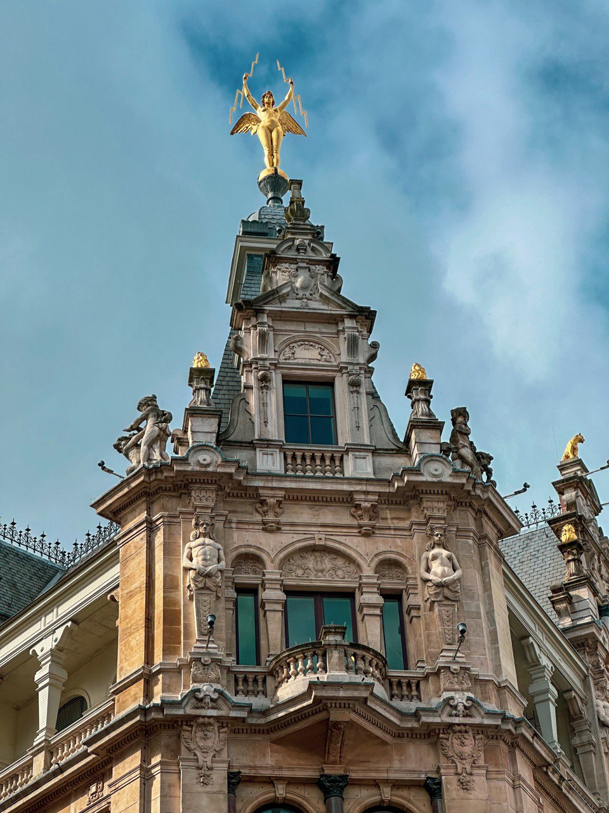
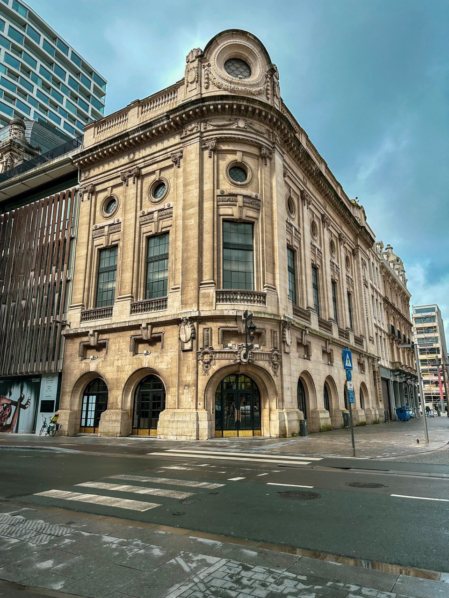
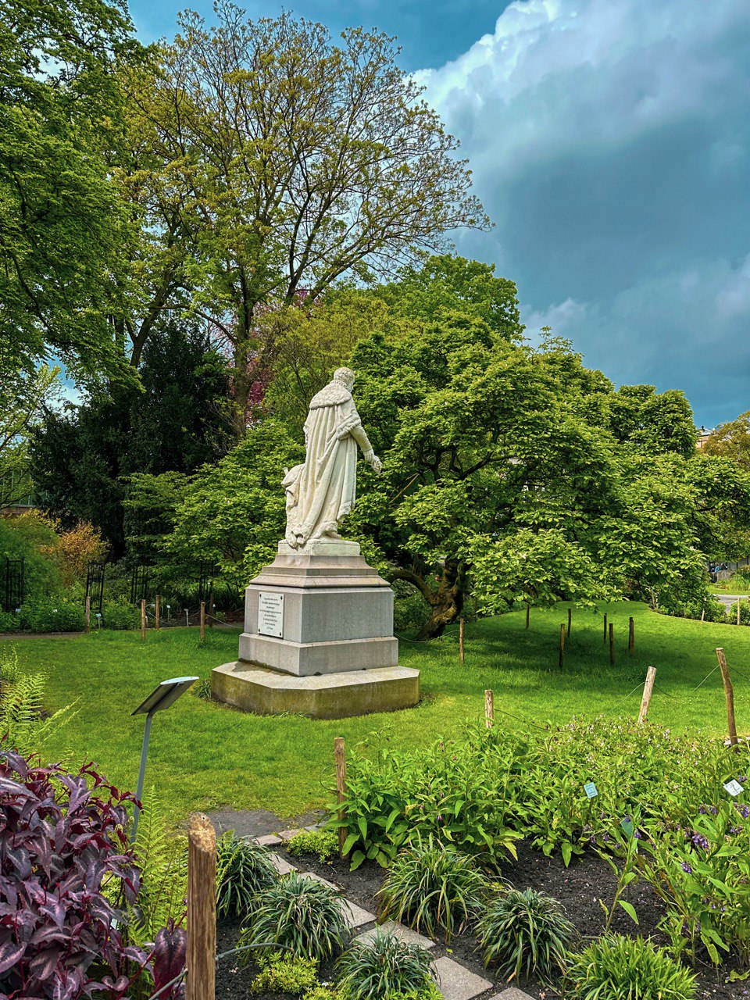
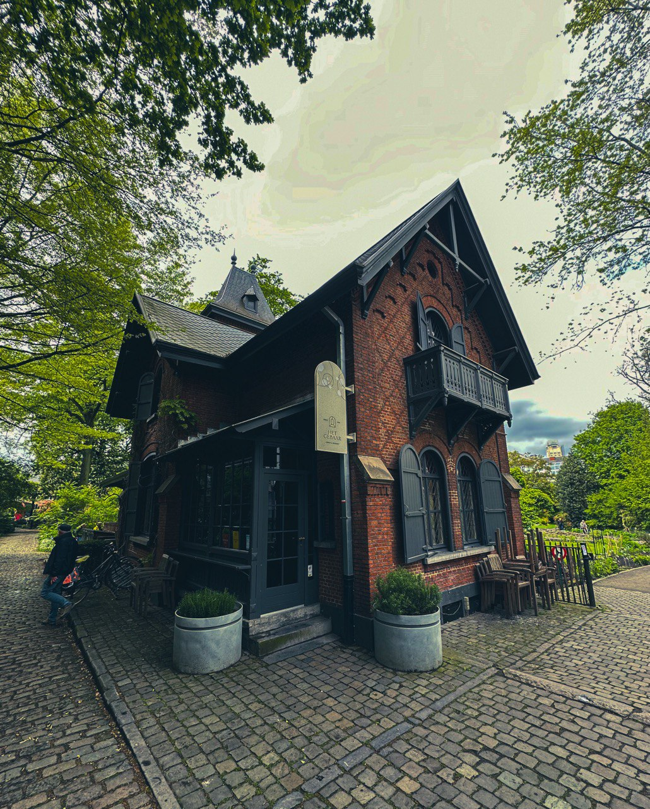
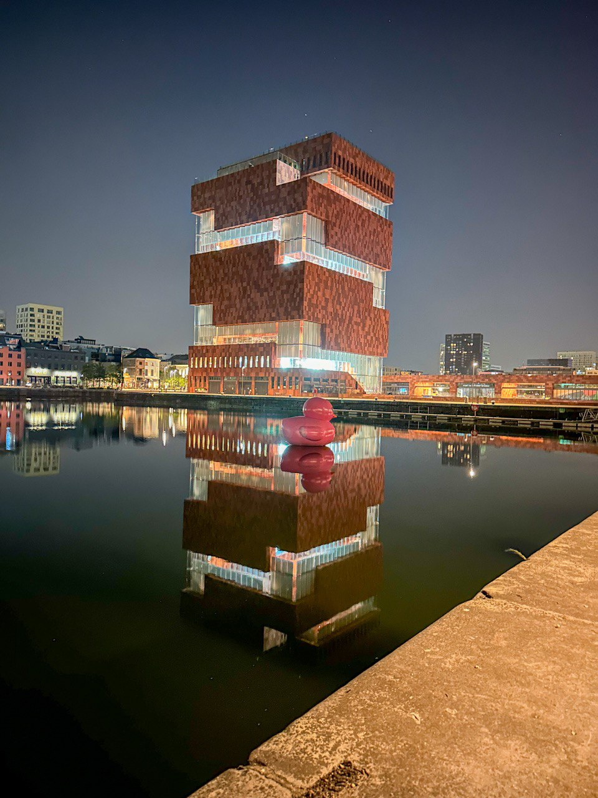
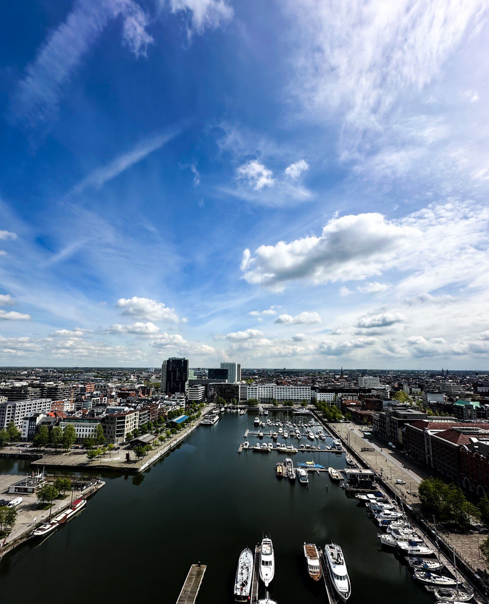
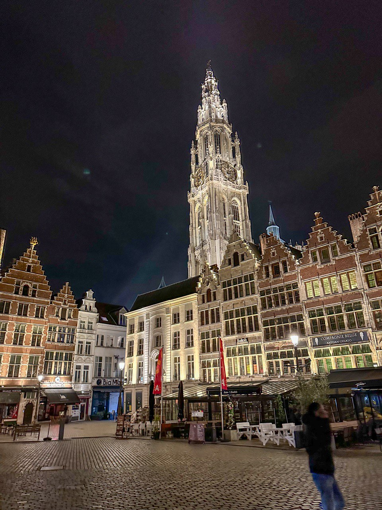

## SDWorx Exchange Program 2024 : A Glimpse into the Journey

Hi there! I'm Fawwaaz, a Cloud Engineer from Mauritius working at SDWorx Mauritius. This year, I had the incredible opportunity to participate in the SDWorx Exchange Program in Belgium. It has been a journey filled with new experiences, exciting challenges, and unforgettable memories. Let me share some of my adventure with you so far!

### First Impressions

Landing in Antwerp for the first time felt like stepping into a postcard. The elegant blend of Gothic and Baroque architecture, the lively streets filled with cyclists, and the aroma of freshly baked waffles created an enchanting atmosphere. Little did I know, this was just the beginning of an extraordinary journey

### A Visit to Den Botaniek

During my first days in Belgium, I visited Den Botaniek in Antwerp. Established in 1825, this historic oasis features over 2,000 plant species, including medicinal herbs, trees, and flowers. Wandering among the beautiful sculptures and lush greenery provided a peaceful escape from the city's hustle and bustle, making it a memorable highlight of my trip.

### Exploring MAS: A Towering Experience

I visited the Museum aan de Stroom (MAS) in Antwerp. The museum's stunning architecture and diverse exhibitions provided a deep dive into the city’s rich history and culture. The highlight of my visit was reaching the rooftop terrace, where I enjoyed breathtaking panoramic views of Antwerp and its bustling port, making the experience truly unforgettable.

### Nighttime Charm of Grote Markt

At night, Grote Markt in Antwerp transforms into a magical scene. The historic square, framed by stunning guild houses and the iconic Brabo Fountain, glows with soft lights and lively ambiance from nearby cafes and restaurants. Strolling through this enchanting setting, you'll experience the timeless allure of Antwerp's architectural beauty and vibrant nightlife.

### Just a Prelude to the Thrilling Adventures Ahead!

As captivating as my initial days in Antwerp have been, they are just a glimpse of the vibrant experiences I've encountered during my time in Belgium. In the upcoming blog posts, I'm excited to delve deeper into the exhilarating activities like roller coaster, biking tours, scenic hikes, leisurely walks through historic neighborhoods, immersing myself in music festivals, and savoring the diverse culinary delights. Stay tuned for more tales of adventure and discovery from this remarkable journey!